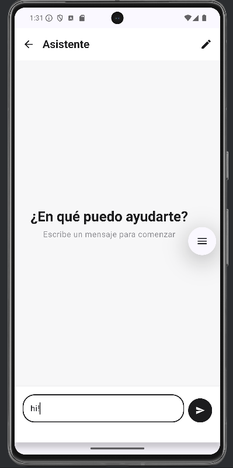

# AppKotlin

A full-stack sample app combining a **Kotlin** frontend with a **Laravel (PHP)** backend.
---
## 🖼️ Screenshots

> Click any screenshot to open the full-resolution image.

### Login
  

### Home
  

### Chat Inicio
  

### Chat
  

### Configuration
  

### Profile
  

### Register
  

---

## Project overview

**AppKotlin** demonstrates a Kotlin-based frontend (Android, Kotlin/JS, or Kotlin Multiplatform — adapt as needed) communicating with a Laravel API backend. Use it as a starter template or reference implementation.

---

## Tech stack

- **Frontend:** Kotlin (Android)  
- **Backend:** Laravel (PHP)  
- **Database:** MySQL / MariaDB (or SQLite for quick local dev)  
- **Tools:** Composer, PHP, Java JDK, Gradle (or included Gradle wrapper), Node.js / npm (if Kotlin/JS)

